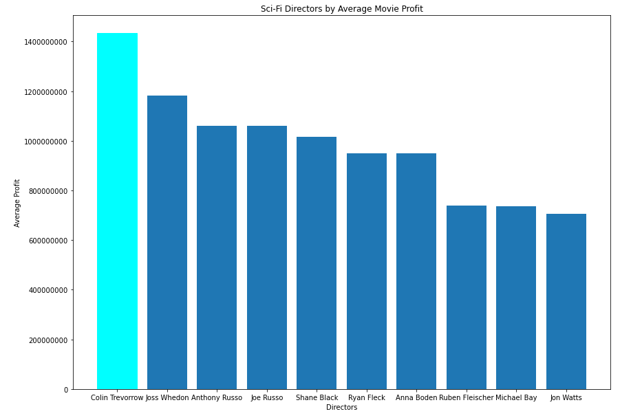

# Flatiron-Movie-Genre-Analysis

Created for the August 2024 Flatiron Data Science Cohort. A collection of insights for a company looking to get into the movie making business, focusing on qualites that a movie should have in order to maximize its earning potential. 

### Authors

Jackson Robbins: https://github.com/Jmanitou

Joey Barlia: https://github.com/JoeyBarlia

## Project Structure
```
├── data
│   ├── im.db
│   ├── Output_Data_All.csv
│   ├── Output_Data_SciFi.csv
│   └── tn.movie_budgets.csv.gz
├── images
│   ├── scifi_budgets.png
│   ├── scifi_directors.png
│   ├── scifi_linear_regression.csv
│   └── top_five_genres.png
├── .gitignore
├── README.md
├── Phase_Two_Movie_Project.pdf
└── Movie_Genre_Analysis.ipynb
```

## Business Understanding 

A company is interested in creating a new movie studio to stay competitive, but they do not know anything about creating movies.

Our goal was to determine which movies are doing best at the box office and make three recommendations for our company to use when deciding what type of films to create

## Data
The data we were provided was from [IMDB](https://www.imdb.com/), [Box Office Mojo](https://www.boxofficemojo.com/), [Rotten Tomatoes](https://www.rottentomatoes.com/), [TheMovieDB](https://www.themoviedb.org/), and [TheNumbers](https://www.the-numbers.com/). 

We decided to incorporate [IMDB](https://www.imdb.com/) and [TheNumbers](https://www.the-numbers.com/) data into our code as they provided different details about movies. IMDB gave us a look at a movie's genres and director, while TheNumbers gave us the budget and gross for the movie.

The data from TheNumbers was from 1915 to 2020, while the data from IMDB was from 2010 to 2020, which restricted the final merged data to a range from 2010 to 2020.

To run the code, you must extract the imdb code and leave it where it gets extracted to. TheNumbers data can be left as its compressed format.

## Presentation
The link to our presentation is [here](https://docs.google.com/presentation/d/1pH1hHfyZQmZ3kh7sWvf5r7A-bA_YAVCb6NYaPtmIeRw/edit?usp=sharing).

## Visualizations 

### Profits of Top 5 Most Popular Movie Genres


### Sci-Fi Directors by Profit



### Average Profit of Budget Ranges


### Sci Fi Movie Profit by Budget 


## Conclusion

* Film in the Sci-Fi Genre

* Film directed by Colin Trevorrow

* Fund a film around 150,000,000 to 200,000,000


## Next Steps 

* Look into older and newer movie data

* Look into data that shows popular Sci-Fi literature that hasn't been adapted yet


